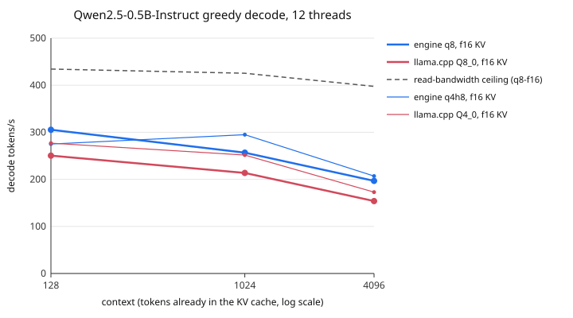

# cpu-decode

A from-scratch C++ decoder for one model, Qwen2.5-0.5B-Instruct, measured against its memory-read ceiling and against llama.cpp.

**Question:** can an engine written for exactly one architecture beat a general one by fusing operations and laying out memory for that architecture, at equal output quality?



**Answer on the measured machine:** yes, at long context. With the same 8.5-bit weight format and the same F16 KV cache, the engine decodes **1.20× faster than llama.cpp Q8_0 at 4096 tokens with 6 threads (119.6 vs 99.6 tokens/s) and 1.28× faster with 12 threads (196.8 vs 153.9)**, with the same KL divergence from an FP32 reference. At 128 tokens the lead is 0.96–1.22× depending on thread count. Against llama.cpp's Q4_0 it is slower at 128 tokens (0.79–0.99×) and faster at 4096 tokens at every thread count (1.08–1.20×).

These numbers are from a 16-core AWS Neoverse-V2 (AArch64, NEON kernels), not the Zen 5 laptop the [v1 results](https://github.com/mottopanikeiku/cpu-decode/tree/d98ba9c) came from. The x86 path uses AVX-512 VNNI and is tested for correctness through SIMDe emulation in CI, but its speed has not been measured yet; `make measure` on the laptop regenerates every table and the chart.

## Results

[All thread counts](results/tables.md) · [raw runs](results/measurements) · [ablations](results/ablations). Medians of three repeats of 16 decoding steps after one warmup step. Context is the initial cache length; filling it is not timed.

| Threads | Context | Engine q8 | llama.cpp Q8_0 | Engine / llama | % of read ceiling |
|---:|---:|---:|---:|---:|---:|
| 6 | 128 | 202.5 | 184.5 | 1.10× | 73% |
| 6 | 1024 | 173.2 | 149.6 | 1.16× | 64% |
| 6 | 4096 | 119.6 | 99.6 | 1.20× | 47% |
| 12 | 128 | 305.4 | 250.4 | 1.22× | 70% |
| 12 | 1024 | 256.7 | 213.6 | 1.20× | 60% |
| 12 | 4096 | 196.8 | 153.9 | 1.28× | 50% |

Both read the same bytes: q8 and Q8_0 are both 8.5 bits per weight and the measured per-token traffic is identical ([traffic.json](results/traffic.json)).

**Quality.** KL(FP32 reference ‖ candidate) in nats, mean / worst over positions:

| Path | 4 short prompts (60 positions): top-1, KL | Long text, positions 960–1023 and 4032–4095: top-1, KL |
|---|---|---|
| Engine BF16, F32 KV | 32/32 greedy tokens; max logit error 0.00032 | 128/128, 7e-11 / 7e-10 |
| Engine q8, F16 KV | 58/60, 0.0090 / 0.178 | 123/128, 0.0027 / 0.015 |
| llama.cpp Q8_0, F16 KV | 55/60, 0.0102 / 0.172 | 125/128, 0.0028 / 0.0095 |
| Engine q4h8, F16 KV | 41/60, 0.711 / 6.96 | 96/128, 0.154 / 0.527 |
| llama.cpp Q4_0, F16 KV | 43/60, 0.714 / 6.97 | 98/128, 0.153 / 0.526 |

Sources: [quality-summary.json](results/quality-summary.json), [llama-quality.json](results/llama-quality.json), [llama-quality-q4_0.json](results/llama-quality-q4_0.json), [long-context.json](results/long-context.json). v1's per-row int8 scales gave a mean KL of 0.029 on the same prompts; 32-weight blocks bring it level with Q8_0.

**What mattered** (6 threads, [paired ablations](results/tables.md#paired-ablation-effects)): SIMD integer kernels over scalar 1.64× at 128 tokens and 2.62× at 4096; q4 projections 1.07–1.13×; a q4 head on top 1.04–1.07×. Fused projections (1.01×), huge pages (≤1.00×) and F16 instead of F32 KV (0.97–1.00×) made no measurable difference on this machine; the laptop may differ.

## How it works

- **Weights:** 32-weight blocks with F16 scales, as in Q8_0/Q4_0. The input vector is quantized to int8 per 32-element block once and reused by every matrix that reads it.
- **Integer dot products:** `vpdpbusd` on x86 with the weight sign bit flipped (`w XOR 0x80`) and the resulting `128 × Σa` offset preloaded into the accumulator; `sdot` on AArch64.
- **Attention:** each K/V row is read once per KV head and scored against all seven query heads that share it. Each KV head's history is split into per-thread chunks with an online softmax, and the partial results are merged (flash decoding).
- **Threads:** one OpenMP parallel region per token with a barrier between phases, instead of one region per operation. Q/K/V and gate/up each run as one fused row range.
- **Memory:** weights are copied into 2 MiB-aligned memory advised for transparent huge pages; the KV cache is F16 and stored per KV head.

[docs/BASELINE.md](docs/BASELINE.md) lists what still differs from llama.cpp; [docs/MEASUREMENTS.md](docs/MEASUREMENTS.md) gives the protocol.

## Reproduce

Linux on x86-64 (AVX-512 VNNI for the fast path) or AArch64 (dot-product extension), a C++17 compiler with OpenMP, CMake and [uv](https://docs.astral.sh/uv/).

```sh
make build
make prepare            # download the pinned model, quantize q8/q4/q4h8, build pinned llama.cpp, check correctness
make measure            # bandwidth, engine and llama.cpp sweeps, ablations, tables and chart
make llama-quality long-context traffic
make test
```

llama.cpp is pinned to `6c73b3e12dc501de35fe5f6979960d06921a2f6c` and built from source; its GGUFs are converted from the same verified BF16 snapshot. Threads are pinned with `OMP_PROC_BIND=close OMP_PLACES=cores`; `tools/measure.py --places fast` restricts runs to the highest-clocked cores on chips that mix core types.

## Limitations

- One model, and one machine for speed; clocks were not fixed. The x86 kernels have not been timed. The read ceiling comes from a streaming read benchmark, not DRAM counters.
- Only decoding is measured. The engine fills its context one token at a time and has no batched prefill, so it would lose badly on prompt processing.
- llama-bench uses synthetic tokens and skips sampling; the engine repeats a fixed token sequence and includes greedy argmax. The pinned llama-bench cannot run an F32 KV cache, so F32 is an engine-only ablation.
- Quality is measured on four short prompts and one 4096-token text. These are distribution checks, not task accuracy.

## Prior work

[llama.cpp](https://github.com/ggml-org/llama.cpp) is the baseline and the source of the block formats; [docs/PRIOR_WORK.md](docs/PRIOR_WORK.md) also covers llama2.c, gemma.cpp, llamafile, T-MAC and BitNet. [Qwen](https://huggingface.co/Qwen/Qwen2.5-0.5B-Instruct) weights are Apache-2.0; [Transformers](https://github.com/huggingface/transformers) is the reference. The decoder core is written from scratch and is MIT licensed.

Written with AI coding assistance.
