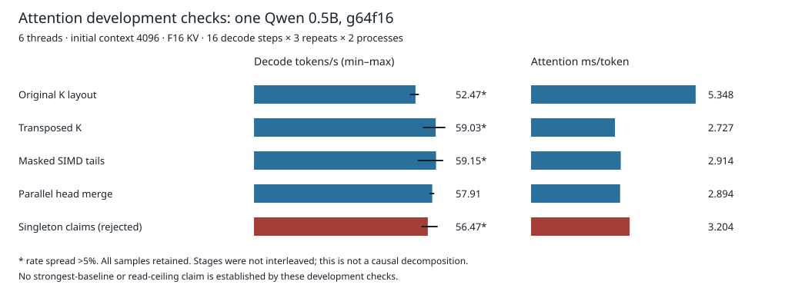

# cpu-decode

A small C++ engine for single-stream CPU decoding of pinned Qwen checkpoints.

**Question:** How close can int8 decoding get to a laptop's read-bandwidth ceiling without losing the quality comparison with llama.cpp Q8_0?

I built the complete memory-mapped forward pass in [model.cpp](src/model.cpp), grouped-int8 SIMD matrix-vector kernels in [kernels.cpp](src/kernels.cpp), and shared-GQA attention in [attention.cpp](src/attention.cpp). K is transposed into 64-token blocks; AVX-512 scores 16 tokens together, uses a tested vector exponential, and merges blocks in fixed order per head. Persistent workers avoid repeatedly creating CPU teams.

**Current result:** On the 512-position calibration split, **g64f16** is the smallest tested artifact that beats Q8_0 on mean KL, p99 KL and top-1 agreement. Its perplexity is slightly worse. The full final speed matrix is **not run**, so no all-context victory or read-ceiling target is claimed.

## Quality and format choice

[The calibration decision and all four formats](results/v2/format-calibration.json) compare the same original-BF16-storage/FP32-arithmetic oracle, fresh F16 caches and exact teacher-forced tokens. Choose the fewest artifact bytes among formats with strictly lower mean/p99 KL and strictly higher top-1 agreement than Q8_0; perplexity is reported, not used for selection.

| Calibration path | Matrix bits/weight | Artifact MB | Mean KL, nats | p99 KL, nats | Top-1 agreement | Perplexity |
|---|---:|---:|---:|---:|---:|---:|
| [g64f16](results/v2/cal-g64f16.json) | 8.25 | 509.73 | 0.00080124 | 0.00262021 | 98.05% | 25.25774 |
| [llama.cpp Q8_0](results/v2/cal-q8_0.json) | 8.50 | 531.07 | 0.00236397 | 0.00697494 | 97.27% | 25.23197 |

Artifact MB includes container/non-matrix overhead; bits count matrix int8 plus scales. The disjoint [heldout split](results/v2/corpus.json) has 2,048 scored positions. Final-binary g64f16 confirmation is not yet recorded here; the earlier [g32f16 comparison](results/v2/quality.json) is historical, not evidence for the newly shipped format. Neither distribution agreement nor perplexity establishes downstream task accuracy.

## Attention development checks



[Raw stage records and figure data](results/v2/attention-stages.json) use the same g64f16 artifact, six threads and context 4096. Transposition reduced median attention time from **5.348 to 2.727 ms/token**; later masked-tail and parallel-merge windows measured **2.914 and 2.894 ms/token**. Singleton claims measured **3.204 ms/token** and were rejected as the default. Several windows have >5% rate spread; these separately timed stages are not a causal decomposition.

The unchanged [original engine](results/tables.md) approached the short-context ceiling but lost at long contexts. Its per-row artifact and quality checks must not be confused with g64f16.

## Reproduce

Requires Linux x86-64, C++17/OpenMP, CMake and uv; AVX-512 for the recorded kernel. Measurements used a Ryzen AI 5 PRO 340, GCC 16.2.1 and a 2000 MB process-group memory cap, not a measured peak. Compute is local CPU, free downloads, **$0 paid compute**. Use fresh output directories and exclusive timing access.

```sh
nice -n 19 make prepare
nice -n 19 make quality
nice -n 19 make final
```

The last command runs all baseline configurations sequentially and resumes accepted units after interruption. [Methods, numerical bounds, raw-output handling and scheduling](docs/MEASUREMENTS.md) explain its cost and remaining differences. Model weights and raw logits stay outside git.

## Limitations

- One laptop and the current 0.5B model; clocks/temperatures are not fixed.
- The read ceiling estimates minimum byte traffic, not measured DRAM utilization.
- Native greedy trajectories and upstream synthetic tokens differ; neither timing includes prompt processing.
- Calibration is small. Heldout cannot choose a replacement format. VNNI activation quantization remains experimental.
- No batched serving, speculative decoding or downstream task evaluation.

## Prior work

[Qwen](https://huggingface.co/Qwen/Qwen2.5-0.5B-Instruct) supplies Apache-2.0 weights; [Transformers](https://github.com/huggingface/transformers) supplies the oracle. [llama.cpp](https://github.com/ggml-org/llama.cpp) is the native baseline, pinned to [this build](results/llama-preparation.json). [Prior-work notes](docs/PRIOR_WORK.md) also cover llama2.c, gemma.cpp, llamafile, T-MAC and BitNet. The decoder core is written from scratch; its code is MIT licensed. The optional baseline-quality reader links upstream libraries.

Written with AI coding assistance.
